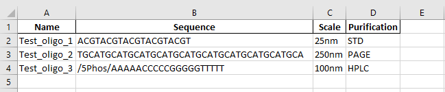
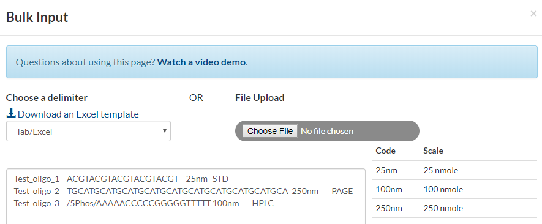
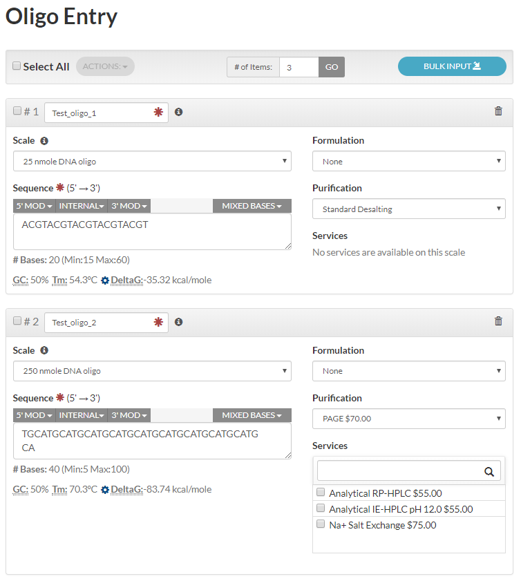
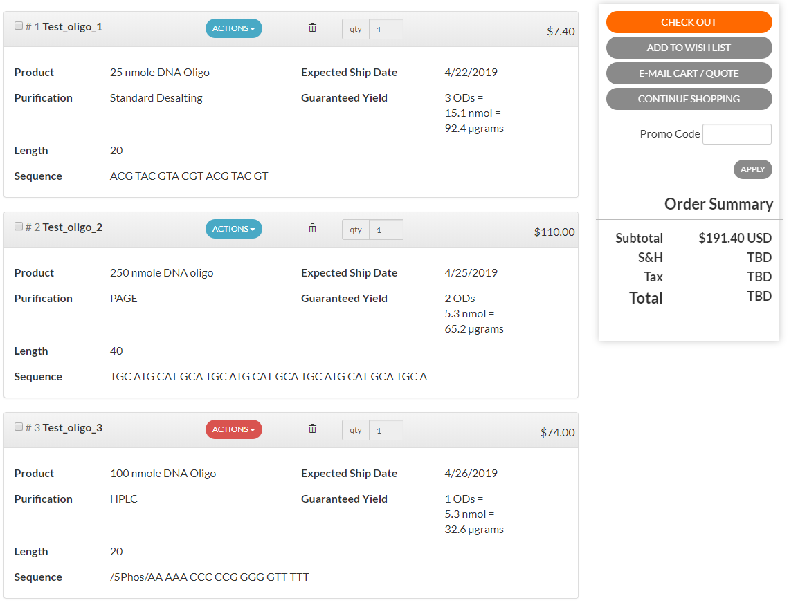

# py_idt

A python interface for creating [IDT](https://www.idtdna.com/site/order/oligoentry) bulk oligo order forms in Excel.

You might find this module useful if you design DNA oligos in python and then order them from IDT.

### Installation and Usage

1. Install the `py_idt` module:

* Option 1) Using `conda`:

    A minimal conda [environment.yml](./environment.yml) is provided:

    ```
    name: py_idt_env
    channels:
      - defaults
    dependencies:
      - pip=19.0.3
      - python=3.7.3
      - pip:
        - git+ssh://git@github.com/conorcamplisson/py_idt.git
    ```

    To create and activate a conda environment using this file:

    ```
    $ git clone git@github.com:conorcamplisson/py_idt.git
    $ cd py_idt/
    $ conda env create -f environment.yml
    $ source activate py_idt_env
    ```

* Option 2) Using `pip`:

    ```
    $ pip install git+ssh://git@github.com/conorcamplisson/py_idt.git
    ```


2. Example usage ([test_module.py](./test_module.py)):

```
from py_idt import IDTOrder

# configure output directory
IDTOrder.settings['output_dir'] = 'example_order'

def main():

    # create a new IDT oligonucleotide order
    order = IDTOrder()

    # add some oligos to this order
    order.add_oligo('Test_oligo_1', 'ACGTACGTACGTACGTACGT')
    order.add_oligo('Test_oligo_2', 'TGCATGCATGCATGCATGCA', scale='250nm', purification='PAGE')
    order.add_oligo('Test_oligo_3', '/5Phos/AAAAACCCCCGGGGGTTTTT', scale='100nm', purification='HPLC')

    # create Excel IDT bulk order form
    order.save()


if __name__ == '__main__':
    main()
```

An Excel file suitable for upload to IDT's custom DNA oligo bulk input form is generated:

`/example_order/<timestamp>_idt_order.xlsx`



3. To order oligos using IDT's Bulk Input feature, upload the Excel file here: https://www.idtdna.com/site/order/oligoentry



4. Once you upload the Excel file, click "Update" to generate the oligos.



5. At this point, you can add the oligos to your cart and check out.


