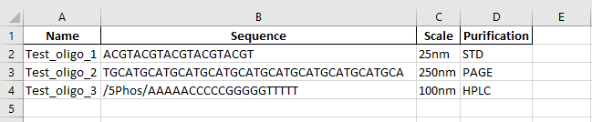
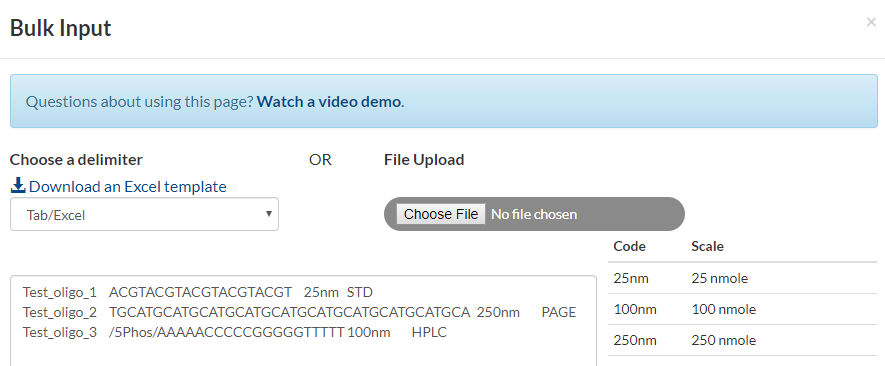
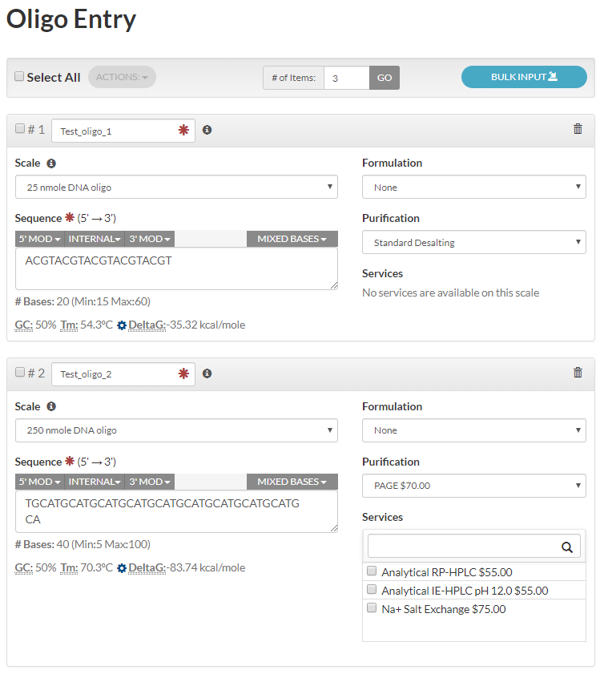
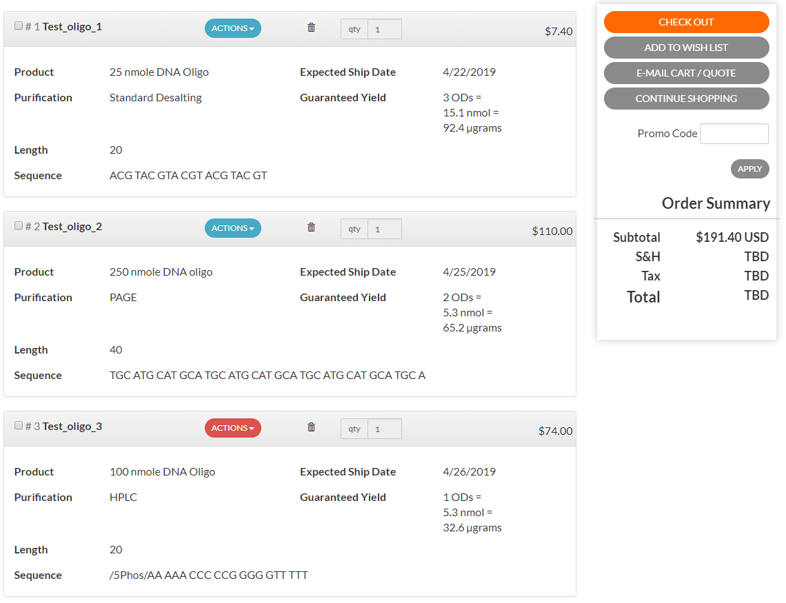

# py_idt

A python interface for creating [IDT](https://www.idtdna.com/site/order/oligoentry) bulk oligo order forms in Excel.

[](https://pypi.org/project/py_idt/)
[](https://pypi.org/project/py_idt/)
[](https://github.com/conorcamplisson/py_idt/actions/workflows/ci.yml)
[](https://conorcamplisson.github.io/py_idt/)
[](./LICENSE)

You might find this module useful if you design DNA oligos in python and then order them from IDT.

## Install

```bash
pip install py_idt
```

## Quickstart

```python
from py_idt import IDTOrder

# where the .xlsx will be written
IDTOrder.settings['output_dir'] = 'example_order'

# an order carries defaults that each oligo can override
order = IDTOrder()

order.add_oligo('Test_oligo_1', 'ACGTACGTACGTACGTACGT')
order.add_oligo('Test_oligo_2', 'TGCATGCATGCATGCATGCATGCATGCATGCATGCATGCA',
                scale='250nm', purification='PAGE')
order.add_oligo('Test_oligo_3', '/5Phos/AAAAACCCCCGGGGGTTTTT',
                scale='100nm', purification='HPLC')

# write the IDT bulk order form
order.save()
```

That writes an Excel file suitable for upload to IDT's custom DNA oligo bulk input form:

`example_order/<timestamp>_idt_order.xlsx`

[](#)

A runnable version of this is in [examples/basic_order.py](./examples/basic_order.py).

## Ordering from the generated file

1. Upload the Excel file to IDT's Bulk Input page: https://www.idtdna.com/site/order/oligoentry

   [](#)

2. Click "Update" to generate the oligos.

   [](#)

3. Add the oligos to your cart and check out.

   [](#)

## Documentation

Full documentation, including the API reference, is at
<https://conorcamplisson.github.io/py_idt/>.

## License

MIT. See [LICENSE](./LICENSE).
